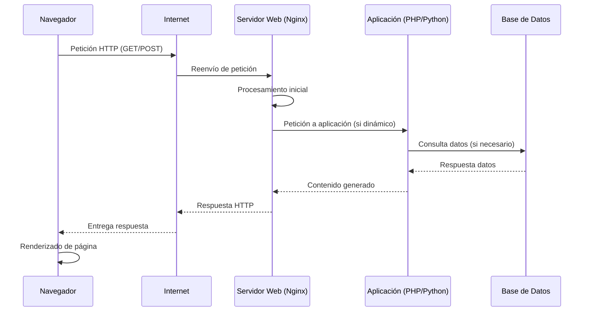

# Tienda Reactiva - Arquitectura de Microservicios

## 📋 Descripción

Arquitectura robusta de microservicios para una plataforma de e-commerce con:

- ✅ **Frontend Reactivo**: Aplicación React moderna e interactiva
- ✅ **Microservicios**: Servicios independientes y escalables
- ✅ **Base de Datos**: PostgreSQL para persistencia de datos
- ✅ **Orquestación**: Docker Compose para gestión de servicios
- ✅ **API Gateway**: Nginx como reverse proxy y enrutador

---

## 🏗️ Arquitectura

```
┌─────────────────────────────────────────────────────────────┐
│                    Navegador del Usuario                     │
└────────────┬────────────────────────────────────────────────┘
             │ HTTP
             ▼
┌─────────────────────────────────────────────────────────────┐
│            API Gateway (Nginx - Puerto 80)                   │
│  - Reverse Proxy                                             │
│  - Rate Limiting                                             │
│  - Compresión Gzip                                           │
│  - Headers de Seguridad                                      │
└──┬──────────────────┬──────────────────┬────────────────────┘
   │                  │                  │
   ▼                  ▼                  ▼
 Frontend          Products API       Orders API
 React 3000        Node.js 3001       Node.js 3002
                      ▲                   ▲
                      │                   │
                      └───────────┬───────┘
                                  │
                                  ▼
                        PostgreSQL (Puerto 5432)
                        - Tabla: products
                        - Tabla: orders
```

---

## 📁 Estructura de Directorios

```
Docker_IAW/
├── frontend/                    # Frontend React
│   ├── src/
│   │   ├── components/         # Componentes React
│   │   │   ├── Header.js
│   │   │   ├── ProductList.js
│   │   │   ├── ProductCard.js
│   │   │   └── Cart.js
│   │   ├── App.js             # Componente principal
│   │   ├── App.css
│   │   └── index.js
│   ├── public/index.html
│   ├── package.json
│   └── Dockerfile
│
├── services/
│   ├── products-service/       # Microservicio de Productos
│   │   ├── server.js
│   │   ├── package.json
│   │   └── Dockerfile
│   │
│   └── orders-service/         # Microservicio de Órdenes
│       ├── server.js
│       ├── package.json
│       └── Dockerfile
│
├── api-gateway/                # API Gateway (Nginx)
│   ├── nginx.conf
│   ├── default.conf
│   └── Dockerfile
│
├── docker-compose.yml          # Orquestación de servicios
├── .env                        # Variables de entorno
├── .env.example               # Plantilla de variables de entorno
└── README.md                  # Este archivo
```

---

## 🚀 Inicio Rápido

### Requisitos

- Docker 20.10+
- Docker Compose 2.0+
- Git

### Pasos para ejecutar

1. **Clonar el repositorio**
   ```bash
   git clone <tu-repo>
   cd Docker_IAW
   ```

2. **Crear archivo .env**
   ```bash
   cp .env.example .env
   ```

3. **Construir y levantar los servicios**
   ```bash
   docker-compose up -d
   ```

4. **Verificar que todos los servicios estén corriendo**
   ```bash
   docker-compose ps
   ```

5. **Acceder a la aplicación**
   - Frontend: http://localhost/
   - API Productos: http://localhost/api/products
   - API Órdenes: http://localhost/api/orders
   - Healthcheck: http://localhost/health

---

## 🛠️ Servicios

### 1. Frontend (React)
- **Puerto**: 3000
- **Tecnologías**: React 18, Axios
- **Funcionalidades**:
  - Listado de productos reactivo
  - Filtrado por categoría
  - Carrito de compras
  - Gestión de cantidades
  - Realización de órdenes

### 2. Microservicio de Productos
- **Puerto**: 3001
- **Tecnologías**: Express.js, PostgreSQL
- **BD**: Tabla `products`

#### Endpoints de Productos
```
GET    /products              - Obtener todos los productos
GET    /products?category=... - Filtrar por categoría
GET    /products/:id          - Obtener producto por ID
POST   /products              - Crear nuevo producto
PUT    /products/:id          - Actualizar producto
DELETE /products/:id          - Eliminar producto
GET    /health               - Health check
```

### 3. Microservicio de Órdenes
- **Puerto**: 3002
- **Tecnologías**: Express.js, PostgreSQL, UUID
- **BD**: Tabla `orders`

#### Endpoints de Órdenes
```
GET    /orders              - Obtener todas las órdenes
GET    /orders/:id          - Obtener orden por ID o número
POST   /orders              - Crear nueva orden
PUT    /orders/:id          - Actualizar estado de orden
DELETE /orders/:id          - Eliminar orden
GET    /health             - Health check
```

### 4. API Gateway (Nginx)
- **Puerto**: 80
- **Funciones**:
  - Enrutamiento de solicitudes
  - Rate limiting (10 req/s general, 30 req/s API)
  - Compresión Gzip
  - CORS headers
  - Headers de seguridad

### 5. Base de Datos (PostgreSQL)
- **Puerto**: 5432
- **Usuario**: tienda_user
- **Contraseña**: tienda_pass
- **Base de datos**: tienda_db

---

## 📝 Comandos Docker Compose

### Gestión básica
```bash
# Levantar todos los servicios
docker-compose up -d

# Ver estado de los servicios
docker-compose ps

# Ver logs de todos los servicios
docker-compose logs -f

# Ver logs de un servicio específico
docker-compose logs -f products-service

# Detener todos los servicios
docker-compose down

# Detener y eliminar volúmenes (CUIDADO: elimina datos)
docker-compose down -v
```

### Reconstrucción
```bash
# Reconstruir imágenes
docker-compose build

# Reconstruir un servicio específico
docker-compose build products-service

# Reconstruir y reiniciar
docker-compose up -d --build
```

### Acceso a contenedores
```bash
# Entrar en un contenedor
docker-compose exec products-service sh

# Ejecutar comando en un contenedor
docker-compose exec db psql -U tienda_user -d tienda_db
```

---

## 🧪 Testing

### Pruebas manuales con cURL

**Obtener productos**
```bash
curl http://localhost/api/products
```

**Filtrar por categoría**
```bash
curl http://localhost/api/products?category=electronica
```

**Crear orden**
```bash
curl -X POST http://localhost/api/orders \
  -H "Content-Type: application/json" \
  -d '{
    "items": [{"id": 1, "name": "Smartphone", "price": 300, "quantity": 2}],
    "total": 600
  }'
```

---

## 🐛 Troubleshooting

### Los servicios no inician
```bash
# Verificar logs
docker-compose logs -f

# Reconstruir todo
docker-compose down -v
docker-compose build --no-cache
docker-compose up -d
```

### Base de datos no responde
```bash
# Verificar que la BD está corriendo
docker-compose ps db

# Conectarse directamente a la BD
docker-compose exec db psql -U tienda_user -d tienda_db

# Ver logs de BD
docker-compose logs db
```

### Frontend no conecta con API
1. Verificar que el API Gateway está corriendo: `docker-compose ps api-gateway`
2. Verificar variable de entorno: `REACT_APP_API_URL`
3. Revisar logs de Nginx: `docker-compose logs api-gateway`

---

## 📚 Recursos Útiles

- [Docker Documentation](https://docs.docker.com/)
- [Docker Compose Documentation](https://docs.docker.com/compose/)
- [Express.js Guide](https://expressjs.com/)
- [React Documentation](https://react.dev/)
- [PostgreSQL Documentation](https://www.postgresql.org/docs/)
- [Nginx Documentation](https://nginx.org/en/docs/)

1. **Petición del Cliente**: El navegador envía una petición HTTP (GET, POST, etc.) al servidor, incluyendo la URL, headers (como User-Agent, Accept-Language) y posiblemente un body con datos.
2. **Recepción en el Servidor**: El servidor web (Nginx) recibe la petición en el puerto 80 (HTTP) o 443 (HTTPS). Parsea la petición y determina qué recurso se solicita.
3. **Procesamiento**: Si es un sitio dinámico, el servidor pasa la petición a la aplicación (ej. PHP-FPM) que consulta la base de datos si es necesario.
4. **Respuesta**: El servidor genera una respuesta HTTP con código de estado (200 OK, 404 Not Found, etc.), headers y el contenido (HTML, JSON, etc.).
5. **Entrega al Cliente**: La respuesta viaja de vuelta al navegador, que renderiza el contenido.

Este proceso es stateless por defecto, pero puede usar cookies o sesiones para mantener estado.

## 5. Seguridad y Mantenimiento

Para el servidor Nginx, propongo las siguientes buenas prácticas:

### Seguridad:
- **Actualizaciones regulares**: Mantener Nginx y el sistema operativo actualizados para parchear vulnerabilidades conocidas.
- **Configuración SSL/TLS**: Usar certificados Let's Encrypt para HTTPS, configurando cipher suites seguras.
- **Firewall**: Configurar UFW o iptables para limitar puertos abiertos solo a 80/443.
- **Protección contra ataques**: Implementar rate limiting, fail2ban para bloqueo de IPs maliciosas, y headers de seguridad (X-Frame-Options, Content Security Policy).
- **Monitoreo**: Usar herramientas como Nagios o Prometheus para detectar anomalías.

### Mantenimiento:
- **Copias de seguridad**: Realizar backups diarios de la configuración, base de datos y archivos estáticos. Usar herramientas como rsync o servicios en la nube.
- **Monitoreo de logs**: Revisar logs de acceso y error regularmente para identificar problemas.
- **Escalabilidad**: Configurar Nginx con balanceo de carga si el tráfico aumenta.
- **Pruebas**: Realizar pruebas de carga y penetración periódicas.

## Diagrama del Flujo de una Petición HTTP



Este diagrama muestra el flujo típico desde el navegador hasta la base de datos y vuelta.

## Proyecto Funcional con Docker

Para demostrar el proyecto de manera práctica, se ha creado una aplicación web funcional desplegada con Docker usando Node.js y Express para el backend dinámico, con EJS como motor de plantillas.

### Estructura del Proyecto
- `index.js`: Servidor Express que maneja las rutas y lógica.
- `views/index.ejs`: Plantilla para el catálogo principal.
- `views/product.ejs`: Plantilla para la vista de producto individual.
- `public/script.js`: Archivo JavaScript para interactividad del lado cliente.
- `package.json`: Dependencias de Node.js.
- `Dockerfile`: Imagen Docker para la aplicación Node.js.
- `docker-compose.yml`: Orquestación del servicio con Docker.

### Cómo Ejecutar el Proyecto
1. Asegúrate de tener Docker y Docker Compose instalados.
2. Clona o navega al directorio del proyecto.
3. Ejecuta el siguiente comando para construir y levantar los contenedores:

   ```bash
   docker-compose up --build
   ```

4. Abre tu navegador y ve a `http://localhost:8080` para ver la página web.

### Funcionalidades
- Catálogo de productos con filtrado por categoría (usando query params).
- Vistas individuales de productos.
- Interfaz interactiva con JavaScript para añadir productos al carrito (simulado).
- Servidor Express optimizado para desarrollo web dinámico.

Este setup demuestra la arquitectura cliente-servidor, el uso de tecnologías modernas como Node.js, y el funcionamiento de HTTP en un entorno Dockerizado.
