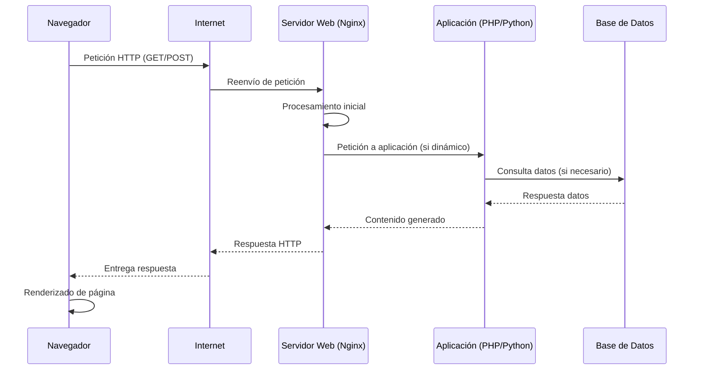

# Docker_IAW
Docker_IAW
# Proyecto: Asesoramiento para Publicación de Primera Página Web

## Descripción del Proyecto

Como administrador de sistemas, debo asesorar a una empresa local (una tienda que requiere un catálogo interactivo) para publicar su primera página web. El análisis incluye determinar si necesita un sitio estático o dinámico, seleccionar el software de servidor adecuado (Apache, Nginx o IIS), y representar el flujo de una petición HTTP mediante un diagrama.

## 1. Análisis de Arquitectura

El modelo cliente-servidor es fundamental para el funcionamiento de las aplicaciones web. En este modelo:

- **Cliente**: Es el navegador web del usuario (como Chrome, Firefox o Edge) que solicita recursos al servidor.
- **Servidor**: Es el sistema que recibe las peticiones, procesa la información y envía las respuestas.

Los componentes necesarios para servir una web incluyen:
- **Servidor Web**: Software que maneja las peticiones HTTP (ej. Nginx, Apache, IIS).
- **Sistema Operativo**: Plataforma donde se ejecuta el servidor (Linux, Windows, etc.).
- **Base de Datos** (para sitios dinámicos): Almacena datos como productos, usuarios, etc.
- **Aplicación Web**: Código que genera contenido dinámico (ej. PHP, Python con Django, Node.js).
- **Red**: Conexión entre cliente y servidor a través de Internet o intranet.

Este modelo permite la separación de responsabilidades, escalabilidad y seguridad.

## 2. Tipología de Web

Para una tienda que requiere un catálogo interactivo, se recomienda un **sitio web dinámico**. Justificación:

- **Interactividad requerida**: Un catálogo interactivo implica funcionalidades como búsqueda de productos, filtros, carritos de compra, formularios de contacto y posiblemente integración con pagos en línea. Un sitio estático solo mostraría páginas HTML fijas sin posibilidad de interacción en tiempo real.
- **Ventajas del dinámico**: Permite personalización del contenido basado en el usuario, actualización automática de inventarios, y procesamiento de datos en el servidor.
- **Desventajas consideradas**: Mayor complejidad en desarrollo y mantenimiento, pero necesario para las necesidades del cliente.

Un sitio estático sería insuficiente ya que no soportaría la interactividad necesaria para una experiencia de compra efectiva.

## 3. Selección Tecnológica

Para el servidor web, selecciono **Nginx**. Justificación basada en rendimiento y seguridad:

- **Rendimiento**: Nginx es conocido por su alta eficiencia en el manejo de conexiones concurrentes, utilizando un modelo de eventos asíncronos que consume menos recursos que Apache. Es ideal para sitios con alto tráfico como una tienda en línea.
- **Seguridad**: Ofrece características avanzadas como protección contra ataques DDoS, configuración de firewalls a nivel de aplicación, y soporte para SSL/TLS con configuraciones seguras. Además, su arquitectura modular permite actualizaciones y parches rápidos.
- **Comparación con alternativas**:
  - Apache: Más flexible con módulos, pero consume más memoria y es menos eficiente en alto tráfico.
  - IIS: Bueno para entornos Windows, pero menos común en servidores web públicos y con menor rendimiento en comparación con Nginx.

Nginx es la elección óptima para una tienda en línea que prioriza velocidad y seguridad.

## 4. Funcionamiento del Protocolo

El protocolo HTTP (HyperText Transfer Protocol) es el estándar para la comunicación web. El proceso funciona así:

1. **Petición del Cliente**: El navegador envía una petición HTTP (GET, POST, etc.) al servidor, incluyendo la URL, headers (como User-Agent, Accept-Language) y posiblemente un body con datos.
2. **Recepción en el Servidor**: El servidor web (Nginx) recibe la petición en el puerto 80 (HTTP) o 443 (HTTPS). Parsea la petición y determina qué recurso se solicita.
3. **Procesamiento**: Si es un sitio dinámico, el servidor pasa la petición a la aplicación (ej. PHP-FPM) que consulta la base de datos si es necesario.
4. **Respuesta**: El servidor genera una respuesta HTTP con código de estado (200 OK, 404 Not Found, etc.), headers y el contenido (HTML, JSON, etc.).
5. **Entrega al Cliente**: La respuesta viaja de vuelta al navegador, que renderiza el contenido.

Este proceso es stateless por defecto, pero puede usar cookies o sesiones para mantener estado.

## 5. Seguridad y Mantenimiento

Para el servidor Nginx, propongo las siguientes buenas prácticas:

### Seguridad:
- **Actualizaciones regulares**: Mantener Nginx y el sistema operativo actualizados para parchear vulnerabilidades conocidas.
- **Configuración SSL/TLS**: Usar certificados Let's Encrypt para HTTPS, configurando cipher suites seguras.
- **Firewall**: Configurar UFW o iptables para limitar puertos abiertos solo a 80/443.
- **Protección contra ataques**: Implementar rate limiting, fail2ban para bloqueo de IPs maliciosas, y headers de seguridad (X-Frame-Options, Content Security Policy).
- **Monitoreo**: Usar herramientas como Nagios o Prometheus para detectar anomalías.

### Mantenimiento:
- **Copias de seguridad**: Realizar backups diarios de la configuración, base de datos y archivos estáticos. Usar herramientas como rsync o servicios en la nube.
- **Monitoreo de logs**: Revisar logs de acceso y error regularmente para identificar problemas.
- **Escalabilidad**: Configurar Nginx con balanceo de carga si el tráfico aumenta.
- **Pruebas**: Realizar pruebas de carga y penetración periódicas.

## Diagrama del Flujo de una Petición HTTP



Este diagrama muestra el flujo típico desde el navegador hasta la base de datos y vuelta.

## Proyecto Funcional con Docker

Para demostrar el proyecto de manera práctica, se ha creado una aplicación web funcional desplegada con Docker usando Node.js y Express para el backend dinámico, con EJS como motor de plantillas.

### Estructura del Proyecto
- `index.js`: Servidor Express que maneja las rutas y lógica.
- `views/index.ejs`: Plantilla para el catálogo principal.
- `views/product.ejs`: Plantilla para la vista de producto individual.
- `public/script.js`: Archivo JavaScript para interactividad del lado cliente.
- `package.json`: Dependencias de Node.js.
- `Dockerfile`: Imagen Docker para la aplicación Node.js.
- `docker-compose.yml`: Orquestación del servicio con Docker.

### Cómo Ejecutar el Proyecto
1. Asegúrate de tener Docker y Docker Compose instalados.
2. Clona o navega al directorio del proyecto.
3. Ejecuta el siguiente comando para construir y levantar los contenedores:

   ```bash
   docker-compose up --build
   ```

4. Abre tu navegador y ve a `http://localhost:8080` para ver la página web.

### Funcionalidades
- Catálogo de productos con filtrado por categoría (usando query params).
- Vistas individuales de productos.
- Interfaz interactiva con JavaScript para añadir productos al carrito (simulado).
- Servidor Express optimizado para desarrollo web dinámico.

Este setup demuestra la arquitectura cliente-servidor, el uso de tecnologías modernas como Node.js, y el funcionamiento de HTTP en un entorno Dockerizado.
